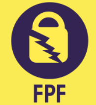

<a name="readme-top"></a>

<!-- PROJECT LOGO -->
<br />
<div align="center">
  <a href="https://github.com/sigurdurb/credit-card-fraud-detector">
    
  </a>

<h3 align="center">Credit Card Fraud Detector</h3>

  <p align="center">
    Credit card fraud is a global problem, with 32 billion dollars in 2021. Existing solutions used by banks rely on rule-based engines, where rules used to detect fraud have to be manually added, and fraud is only detected after it happens. Machine learning offers a promising solution to this, having many advantages compared to more traditional rule-based engines, and in recent years, there has been a lot of research on applying machine learning to this problem. 
    In this project, we develop three fraud detectors based on three machine learning algorithms: Deep Neural Network, Random Forest, and Naïve Bayes, with the goal of detecting fraud in real-time with a minimal number of false positives. 
    <br />
    <a href="https://github.com/sigurdurb/credit-card-fraud-detector"><strong>Explore the docs »</strong></a>
    <br />
    <br />
    <a href="https://github.com/sigurdurb/credit-card-fraud-detector">View Demo</a>
    ·
    <a href="https://github.com/sigurdurb/credit-card-fraud-detector/issues">Report Bug</a>
    ·
    <a href="https://github.com/sigurdurb/credit-card-fraud-detector/issues">Request Feature</a>
  </p>
</div>


<!-- TABLE OF CONTENTS -->
<details>
  <summary>Table of Contents</summary>
  <ol>
    <li>
      <a href="#about-the-project">About The Project</a>
      <ul>
        <li><a href="#built-with">Built With</a></li>
      </ul>
    </li>
    <li>
      <a href="#getting-started">Getting Started</a>
      <ul>
        <li><a href="#prerequisites">Prerequisites</a></li>
        <li><a href="#installation">Installation</a></li>
      </ul>
    </li>
    <li><a href="#usage">Usage</a></li>
    <li><a href="#roadmap">Roadmap</a></li>
    <li><a href="#contributing">Contributing</a></li>
    <li><a href="#license">License</a></li>
    <li><a href="#contact">Contact</a></li>
    <li><a href="#acknowledgments">Acknowledgments</a></li>
  </ol>
</details>


<!-- ABOUT THE PROJECT -->
## About The Project


Credit card fraud is a global problem, with 32 billion dollars in 2021. Existing solutions used by banks rely on rule-based engines, where rules used to detect fraud have to be manually added, and fraud is only detected after it happens. Machine learning offers a promising solution to this, having many advantages compared to more traditional rule-based engines, and in recent years, there has been a lot of research on applying machine learning to this problem. 

In this project, we develop three fraud detectors based on three machine learning algorithms: Deep Neural Network, Random Forest, and Naïve Bayes, with the goal of detecting fraud in real-time with a minimal number of false positives. 

The models are trained and evaluated with a data set from Kaggle [Credit Card Fraud Detection](https://www.kaggle.com/datasets/mlg-ulb/creditcardfraud). The data set containes ~284 000 anonymized credit card transactions labeled as fraudulent or genuine, where only 0.127% are fraudulent.

<p align="right">(<a href="#readme-top">back to top</a>)</p>


### Built With

* [![Python][Python.js]][Python-url]
* [![Scikit-learn][Scikit-learn.js]][Scikit-learn-url]
* [![Tensorflow][Tensorflow.js]][Tensorflow-url]


<p align="right">(<a href="#readme-top">back to top</a>)</p>


<!-- GETTING STARTED -->
## Getting Started

To get a local copy up and running follow these simple example steps.


### Installation

1. Download the data set from Kaggle [Credit Card Fraud Detection](https://www.kaggle.com/datasets/mlg-ulb/creditcardfraud).
2. Clone the repo
   ```sh
   git clone https://github.com/sigurdurb/credit-card-fraud-detector.git
   ```
3. Install required packages
   ```sh
   pip install -r requirements.txt
   ```
4. Playaround as you wish
   ```sh
   python evaludate.py
   ```

<p align="right">(<a href="#readme-top">back to top</a>)</p>


<!-- CONTACT -->
## Team

This Project was developed by **the Fraud Prevention Force**
<div align="center">
  
</div>  

- Eva Ósk [EfaOSk](https://github.com/EfaOsk)
- Guðmundur Óli [gudmunduro](https://github.com/gudmunduro)
- Sigurður [sigurdurb](https://github.com/sigurdurb)

Project Link: [https://github.com/sigurdurb/credit-card-fraud-detector](https://github.com/sigurdurb/credit-card-fraud-detector)


<p align="right">(<a href="#readme-top">back to top</a>)</p>


<!-- MARKDOWN LINKS & IMAGES -->
[contributors-url]: https://github.com/sigurdurb/credit-card-fraud-detector/graphs/contributors
[forks-shield]: https://img.shields.io/github/forks/github_username/repo_name.svg?style=for-the-badge
[forks-url]: https://github.com/sigurdurb/credit-card-fraud-detector/network/members
[stars-shield]: https://img.shields.io/github/stars/github_username/repo_name.svg?style=for-the-badge
[stars-url]: https://github.com/sigurdurb/credit-card-fraud-detector/stargazers
[issues-shield]: https://img.shields.io/github/issues/github_username/repo_name.svg?style=for-the-badge
[issues-url]: https://github.com/sigurdurb/credit-card-fraud-detector/issues
[license-shield]: https://img.shields.io/github/license/github_username/repo_name.svg?style=for-the-badge
[license-url]: https://github.com/sigurdurb/credit-card-fraud-detector/blob/master/LICENSE.txt
[Python.js]: https://img.shields.io/badge/Python-3776AB?style=for-the-badge&logo=python&logoColor=white
[Python-url]: https://www.python.org/
[Scikit-learn.js]: https://img.shields.io/badge/scikit--learn-F7931E?style=for-the-badge&logo=scikit-learn&logoColor=white
[Scikit-learn-url]: https://scikit-learn.org/stable/
[TensorFlow.js]: https://img.shields.io/badge/TensorFlow-FF6F00?style=for-the-badge&logo=tensorflow&logoColor=white
[TensorFlow-url]: https://www.tensorflow.org/
